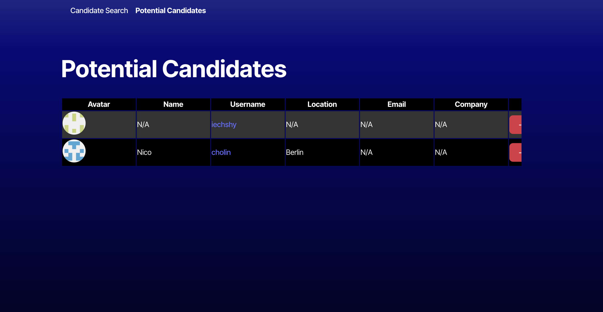
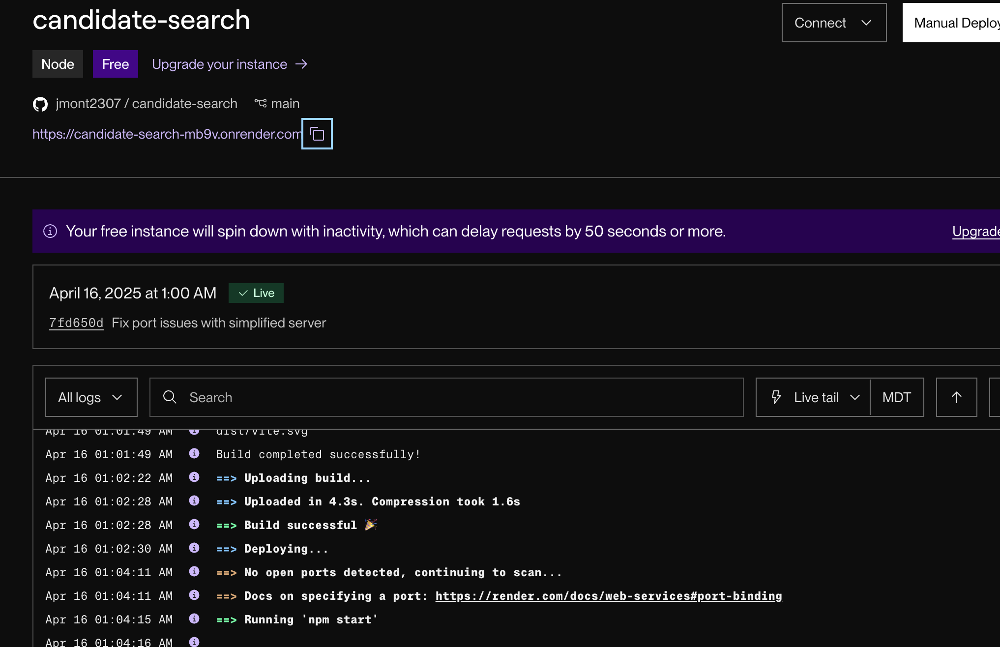

# Candidate Search Application

A TypeScript and React application that calls the GitHub API to search for potential job candidates and save them to a list.

## Description

This application allows users to:
- View GitHub users as potential job candidates
- Accept or reject candidates
- Save accepted candidates to local storage
- View a list of saved candidates
- Remove candidates from the saved list

## Features

- TypeScript for type safety
- React with Vite for fast development
- GitHub API integration
- Responsive UI design
- Local storage persistence

## Installation

1. Clone the repository
```bash
git clone <https://github.com/jmont2307/candidate-search>
cd candidate-search
```

2. Install dependencies
```bash
npm install
```

3. Create a `.env` file in the environment directory
```bash
# Create .env file
cp environment/.env.EXAMPLE environment/.env
```

4. Create a GitHub personal access token:
   - Visit [GitHub's token settings](https://github.com/settings/tokens)
   - Create a new fine-grained token (no additional permissions needed)
   - Copy the token and add it to the `.env` file:
   ```
   VITE_GITHUB_TOKEN=your_token_here
   ```

## Running Locally

```bash
npm run dev
```

Visit `http://localhost:5173` to view the application.

## Screenshots and Deployment

You can access the live application at [Candidate Search](https://candidate-search-mb9v.onrender.com).

### Screenshots

#### Home Page


#### Candidate List


#### Render Deployment


## Technologies Used

- React
- TypeScript
- Vite
- GitHub API
- Local Storage
- React Router

## Credits

This project was created with assistance from:
- Online Learning Assistant
- Claude AI


